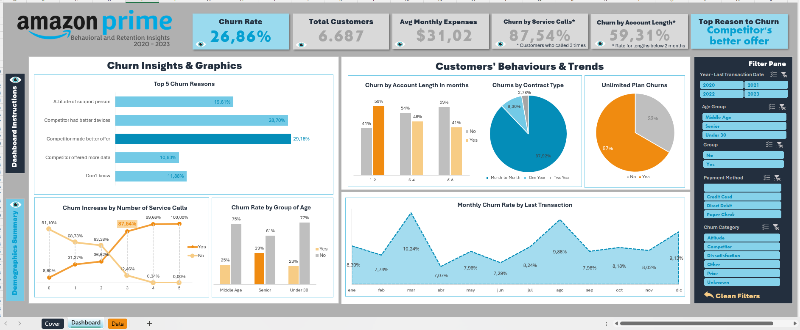
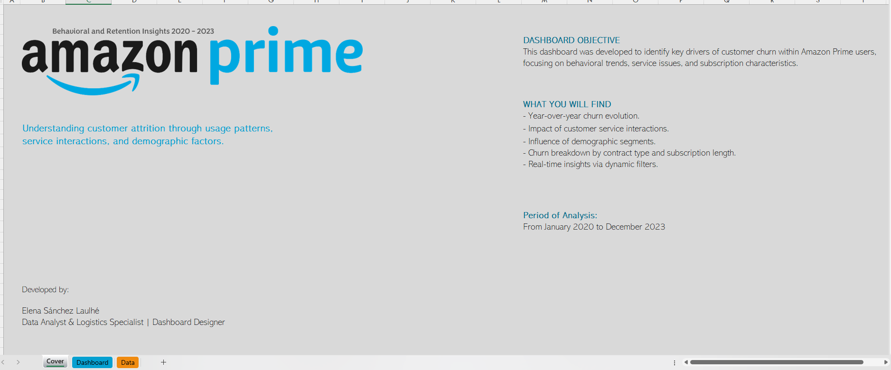
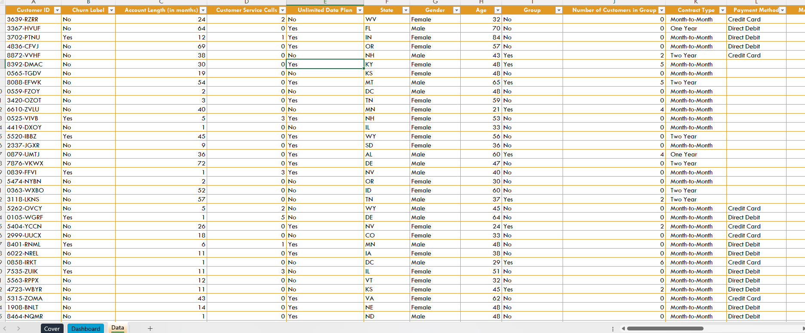

# Amazon Prime – Churn Dashboard


Este proyecto presenta un análisis completo del _churn_ (abandono de clientes) en una empresa ficticia similar a **Amazon Prime**, usando datos simulados. Se parte desde un dataset crudo hasta la construcción de un dashboard ejecutivo en Excel, pasando por la limpieza y el análisis exploratorio de datos.

---

## Objetivos del proyecto

- Procesar y limpiar un dataset de clientes con variables demográficas y de uso.
- Analizar el churn y sus principales causas mediante visualizaciones.
- Diseñar un dashboard interactivo que simule una herramienta de análisis ejecutivo.
- Entregar una solución 100% en Excel, con y sin macros.

---

## Hallazgos clave

- El número de llamadas al servicio técnico está fuertemente relacionado con el abandono.
- Los clientes con contratos mensuales tienen tasas de churn más altas.
- El motivo principal de abandono fue una mejor oferta de la competencia.
- Usuarios con cuentas más recientes (menor antigüedad) abandonan más.

---

## Estructura del repositorio

```
amazon-churn-dashboard/
├── 📁 Data/
│ ├── AmazonChurn_raw_data.xlsx
│ ├── AmazonChurn_cleaning_data.xlsx
│ └── AmazonChurn_Data_Cleaned.xlsx
│
├── 📁 Images/
│ ├── dashboard_preview.png # (captura del dashboard completo)
│ ├── Amazon_logo.png # si vas a usarlo en el README
│ ├── Amazon_Prime_Video_logo.png # lo mismo
│ └── amazon-prime-logo-1.png
│
├── amazon_dashboard.xlsm # Dashboard completo con macros
├── amazon_dashboard.xlsx # Dashboard visual sin macros
├── README.md # Documentación principal del proyecto

```

---

## 📈 Vista previa

### 🧩 Vista general del Dashboard



### 🧾 Portada del Dashboard



### 📑 Dataset limpio en Excel



---

## 📦 Tecnologías utilizadas

- **Excel 365** (macros, tablas dinámicas, segmentadores)
- **Power Query** (procesamiento de datos)
- **Visualización en Excel** (sin herramientas externas)
- **Diseño UX de dashboard en entorno limitado (sí, Excel)**

📌 Seguridad del archivo .xlsm

Este archivo contiene macros simples utilizadas para funciones de visualización y automatización dentro de Excel.  
No contiene información sensible ni código malicioso.  
Se puede revisar fácilmente accediendo al editor de VBA (`Alt + F11`) en Excel.

---

## Contribuciones

Las contribuciones son muy bienvenidas, si tienes alguna sugerencia, mejora o corrección, no dudes en ponerte en contacto o enviar tus ideas.
Cualquier contribución, ya sea código, documentación o feedback, será muy valorado. ¡Gracias por tu ayuda y colaboración!

## 👤 Autora

**Emma Goldman**  
[GitHub – @esanchezlaulhe1312](https://github.com/esanchezlaulhe1312)

---

## Origen de los datos

[Fuente original en Kaggle](https://www.kaggle.com/datasets/muhammadshahidazeem/customer-churn-dataset)

## ⚠️ Disclaimer

> Este es un proyecto de simulación. Los datos utilizados son ficticios y no representan clientes reales de Amazon ni de ninguna otra empresa.

# amazon_analysis
